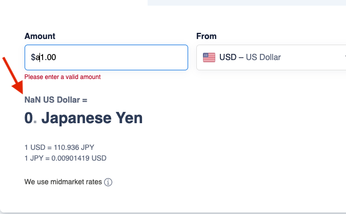
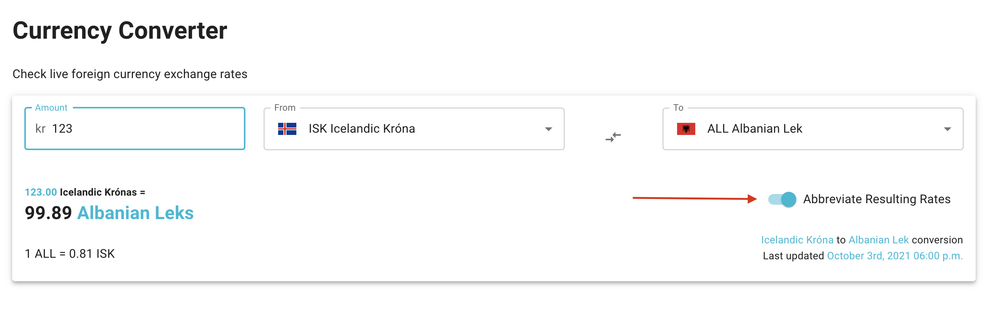

# Currency Conversion Challenge

Currency converter heavily influenced by [XE Currency Converter](https://www.xe.com/currencyconverter/)

## Demo

- [Screenshots](./screen-shots/README.md)
- [Live Demo](https://d3jesfpl6tiycw.cloudfront.net/)

## Getting Started

- Clone the repo
- Install dependencies using `yarn`
- Start the server with `yarn dev`

### All together

```shell
git clone https://github.com/christopher-caldwell/currency-conversion-challenge.git && \
yarn && \
yarn dev
```

## Checklist

- [x] User can enter up to 9 digits to represent the amount to convert in a source input field
- [x] User can view a sorted list of available currencies and select the currency to convert from in a source drop-down list
- [x] User can view a sorted list of available currencies and select the currency to convert to in a destination drop-down list
- [x] User views the value (rounded to two decimal places) of the source amount converted to the destination currency in a single output field as soon as either the input value, the source currency, or the destination currency is changed.
- [x] User must be alerted if the input is not a number
- [x] User should be able to swap the values of the source and destination drop-down lists on the click of a button

## Developing

This project is powered by [Vite](https://vitejs.dev/), an incredible tool for bundling front end code. Checkout their docs to learn more, but the general synopsis is; it's really, really fast.

When the dev server is running, it will constantly be running ESLint and the TypeScript compiler on every save. If there is an issue, you will see the issue in the terminal and in the browser. Just like create-react-app.

These errors **cannot be dismissed**, as they are integral to the integrity of the app.

### Bulletproof React

This is my first attempt with [Bulletproof React](https://github.com/alan2207/bulletproof-react). I have a preference of project structure, but I have been interested in trying this out.

There are some things I am not a fan of, such as all of the index.ts files that just re-export various things. I'm unsure if this is something that will continue, but it's good to try new things out.

### Quirks

I have noticed some oddities when working on this.

- If you save the Provider file, the state is reset to the original. For example:

```tsx title=ChosenCurrencyProvider.tsx
const [baseCurrency, setBaseCurrency] = useState<Currency | null>(null)
```

If this `baseCurrency` has a value, and you save this file, `ChosenCurrencyProvider.tsx`, it will reset to `null`. Kind of annoying, but it only happens on this file ( or anything with state ).

## Testing

I have not done any tests :slightly_frowning_face:

They take a considerable amount of time to do correctly, and it wasn't worth it for this.

## Runtime Libraries Used

- [@mui/material](https://mui.com/getting-started/usage/) ( Material UI )
- [react-query](https://react-query.tanstack.com/)
- [axios](https://axios-http.com/)
- [date-fns](https://date-fns.org/docs/Getting-Started)
- [numeral](http://numeraljs.com/)
- [lodash.capitalize](https://lodash.com/docs/4.17.15#capitalize)
- [react-number-format](https://www.npmjs.com/package/react-number-format)
- [react-window](https://github.com/bvaughn/react-window)
- [currency-flags](https://www.npmjs.com/package/currency-flags)
- [currency-symbol-map](https://www.npmjs.com/package/currency-symbol-map)

## Tooling Used

- [Vite](https://vitejs.dev/)
- [prettier](https://prettier.io/docs/en/)
- [eslint](https://eslint.org/)
- [typescript](https://www.typescriptlang.org/)

## Styling

Styling was done with [MUI v5](). There have been significant changes to this library, and overriding base styles has never been easier.

Some benefits of using v5 have been documented on [their blog](https://mui.com/blog/mui-core-v5/).

## Amount to Convert

Upon landing on the first and only view / page, you'll see 3 input boxes. From left to right, or top to bottom if on mobile, the amount to convert, the base currency to compare from, and the currency to convert into.

The amount input is limited to 9 characters for a validity check. You can input more than 9, but you will immediately see an error message explaining what is wrong. You **cannot** input letters here, as [react-number-format](https://www.npmjs.com/package/react-number-format) is providing an input mask to disallow the usage of non-numeric characters. This was the preferred approach for me, because I couldn't find a library that formats the input, as well as lets letters be typed. So this does not "alert" the user when an invalid character is typed, but still does not allow them to be entered.

If you have chosen a base currency, that currency's symbol will be to the left of your typeable input. This symbol is provided by [currency-symbol-map](https://www.npmjs.com/package/currency-symbol-map). If the symbol cannot be determined, the 3 character currency code will be used.

## Currency Selectors

The other 2 inputs are Autocomplete Text fields that have all of the supported currencies. You can search by country code, or the name of the currency. You can also scroll through the list if you prefer.

These values are persisted to to the URL, meaning you can share a conversion with someone, and they will see the same conversion that you do. This also means your place is not lost should you refresh.

In between the selectors is a button to swap the direction of conversion. This is an easy way to see how much the other currency converts to.

These default to USD and EUR upon first visit.

### Virtualization

Due to there being a high number of currency options, the select options are virtualized using [react-window](https://github.com/bvaughn/react-window). This keeps the drop down preformat and can scale endlessly.

## Conversion

Conversions and supported currencies are powered by a blazing fast CDN. The source can be found [here](https://github.com/fawazahmed0/currency-api) and the CDN endpoint, [here](https://cdn.jsdelivr.net/gh/fawazahmed0/currency-api@1/latest/currencies.json)

They are updated daily, and the service is completely free without the usage of an API Key. This means that sensitive keys are not exposed via the client, and it is not necessary to create a full backend for the conversions.

## Caching

In an attempt to reduce the amount of duplicate API calls, all calls for conversion rates are cached for 12 hours within the app. The CDN is also caching these responses, so there is 2 layers of caching in an attempt to keep the calls to the CDN source, low.

Caching and requests are done with [react-query](https://react-query.tanstack.com/).

The way this tool is built, there **no calls to convert currency**. There is only one call per combination of currencies to get the exchange rate, then the conversion is done on the client without making additional API calls.

This keeps the speed of the app very fast, as the user does not need to wait unless they are changing the specified currency combination. They can freely increase or decrease the amount to be converted with no waiting. The result to get a new conversion rate averages around 500ms.

## Result

When the conversion has been completed, a new section drops down to reveal the result. The result will only be shown when there is a valid amount, and both currency options have been selected.

Doing this prevents the following behavior. Notice the `NaN` shown.

_\*\*This is XE Currency Converter_



### Abbreviating Result

In an attempt to make things slightly easier to read, there is a switch for abbreviating the resulting conversion. If you visit on mobile, this will be engaged by default.

When this switch is engaged, the numbers will read shorter. For example, **1,240,342,123** will read as **1.24b**. This can easily be turned off if you wish to see the full number

The switch is shown at the end of the red arrow in the image below.



## Extending Feature Set

You can **_always_** add more features. If development of this were to continue, I might add the following:

- [ ] Share button to easily send the conversion to someone through the [Web Share API](https://w3c.github.io/web-share/)
- [ ] Chart showing the trend of the compared currency throughout a given time period
- [ ] A list of common denominations in the given currency to show quick conversions. For example, 1x = 10y, 10x = 100y, etc.
- [ ] If applicable, a common way to "guess" how much some currency is worth without using the tool. Such as when comparing Japanese Yen to USD, 100 JPY is close to 1 USD. So you can use that as a rough guide "When comparing Japanese Yen to USD, move the decimal place 2 to the left: 100 becomes 1.00 for USD"
